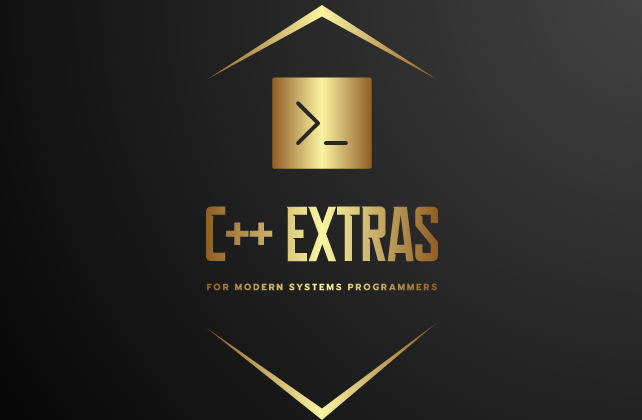

# [(perriera) / extras_cpp](https://github.com/perriera/extras_cpp)

## How to setup a development environment (on Linux, Windows or Mac)

  
   

## Why would you want to do this?

> Usually, when a C++ repository wishes to be cross-platform the idea is to make the C++ code as platform independent as possible. And while this is an ideal of this project (and an objective), we have to take into account all the variables associated with the different platforms (Linux, Windows and Mac, not to mention Android, iOS and countless others). These variables almost always result in "setting a flag" then "setting another flag, and then another". To keep the number of "FLAGS" that have to be set to a minimum, the default option on this library is to compile strictly to a Linux environment. In this way, we remove a lot of complications from the utilization of this library. In the Client/Server world, this will work just fine as this library can be used to write software on server environments. Where a client is required, a JSON relationship can be established. At a later state, (as in when more developers volunteer to add features to this library) we will aspire to a more generic "cross-platform" approach.  That being said we now have included here a series of HOW-TO documents that are aimed to show the developer how to setup a Ubuntu environment on each of the popular, mainstream operating systems, (Linux, Winodws and Mac) for now. 

### Use Case
	GIVEN we need to compile this library on Linux, Windows and Mac
	WHEN we create VMs for either of Linux, Windows or Mac
	THEN we can install Ubuntu and have Ubuntu make life simple for us

### Wish Case

 1. [How to setup a development environment (on Linux, Windows or Mac)](https://github.com/perriera/extras_cpp/blob/dev/docs/ENVIRONMENT.md)
 2. [How to setup a Linux Platform (Ubuntu 20.04.4) on macOS (Parallels Desktop)](https://github.com/perriera/extras_cpp/blob/dev/docs/MAC.md)
 3. [How to setup a Linux Platform (Ubuntu 20.04.4) on Windows 10/11 (VirtualBox)](https://github.com/perriera/extras_cpp/blob/dev/docs/VIRTUALBOX.md)
 4. [How to setup a Linux Platform (Ubuntu 20.04.4) on Windows 10/11 (WSL/WSL2](https://github.com/perriera/extras_cpp/blob/dev/docs/WSLWSL2.md)
 5. [How to setup a Linux Platform (Ubuntu 20.04.4) on Linux](https://github.com/perriera/extras_cpp/blob/dev/docs/LINUX.md)

### Next Steps
 1. [How to install the tools necessary for C++11/17 projects](https://github.com/perriera/extras_cpp/blob/dev/docs/INSTALL.md)
 2. [How to clone your project (with this template)](https://github.com/perriera/extras_cpp/blob/dev/docs/CLONE.md)
 3. [How to setup your changelog.md](https://github.com/perriera/extras_cpp/blob/dev/docs/CHANGELOG.md)

### Summary 
> This has been a basic example of how to install this library on either Linux, Windows or Mac. 
### Special Thanks
> Markup Language created/edited with [SlackEdit.io](https://stackedit.io/app#) 
> C++ EXTRAS logo and CPM support compliments [Matt Williams](https://github.com/mattcoding4days/cmake-starter#) 

### Copyright
> Copyright 2022 EXPARX INCORPORATED ([exparx.com](https://www.exparx.com/)) 
> [Open Source / MIT License](https://opensource.org/licenses/MIT) (see [LICENSE.md](https://github.com/perriera/extras_cpp/blob/dev/LICENSE.md)) 

